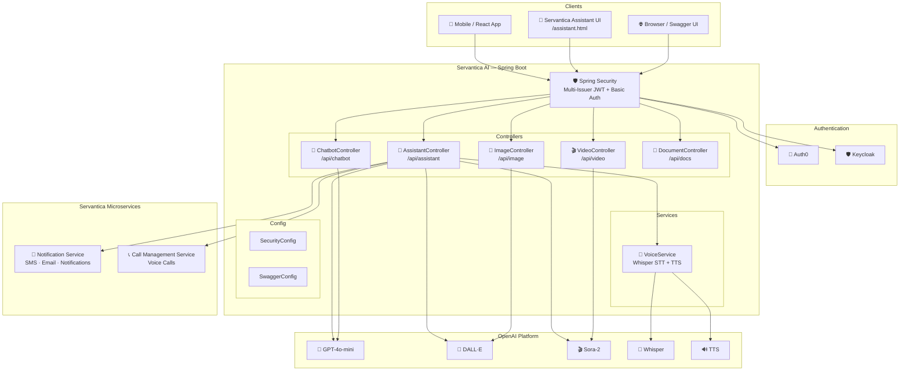

# Servantica.in

Servantica AI Assistant is built for voice-first workflows. Say the wake word, launch voice assistance instantly, and move through SMS, calls, files, and AI tools without reaching for on-screen controls. 

---

## Features

- **Beautiful Marketing Pages**: Landing, About, Features, Testimonials, Pricing, and Contact pages with modern design and navigation.
- **Auth0 + Keycloak Authentication**: Login/sign-up with Google via Auth0 or with Keycloak; tokens are stored for downstream API calls.
- **AI Services** (Azure Cognitive Services):
  - 🎤 **Speech to Text**: Convert audio (WAV) to text.
  - 🗣️ **Text to Speech**: Synthesize speech from text.
  - 😀 **Face Detection**: Detect faces, age, gender, and emotion in images.
  - 🖼️ **Image Analysis**: Analyze images for categories, descriptions, and colors.
- **Dashboard**: Centralized workspace with sidebar navigation.
- **Responsive UI**: Modern, accessible, and mobile-friendly design.
- **Automated Deployment**: GitHub Actions workflow deploys production-ready builds to the `production` branch.
- **Subscription Gating**: SMS/Calls/AI features can be enabled/disabled and marked as paid via config, with Razorpay unlock flow.
- **Tokenized Comms**: Auth0 client-credentials flow caches machine tokens for SMS and Calls to avoid extra round-trips.
- **Real-time Notification System**:
  - Admins can publish notifications of type **info**, **warning**, or **important**.
  - Users receive notifications instantly via Server-Sent Events (SSE) with robust reconnect logic.
  - Toasts display with contextual icons (ℹ️, ⚠️, ❗) and styles based on notification type.
  - Notifications persist in a dedicated section until cleared by the user.

---

## Notification System

- **Admin Notification Publishing**: Admins can send notifications with a selected type (info, warning, important) from the Admin UI. Each type is visually distinct in the UI and toast popups.
- **Toast Icons & Styles**:
  - Info: ℹ️ (blue)
  - Warning: ⚠️ (yellow)
  - Important: ❗ (red)
- **Persistence**: Notifications are stored in localStorage and shown in the notification section until cleared.
- **SSE Robustness**: Handles reconnects, connection errors, and proper cleanup on logout.
- **UI Feedback**: Users see toast popups and a notification section reflecting the latest messages.

---

## Navigation & Pages

- `/` — **Landing Page**: Beautiful hero section, navigation to all main pages.
- `/about` — **About**: Learn about Servantica's mission and capabilities.
- `/features` — **Features**: Explore the platform's unique features.
- `/testimonials` — **Testimonials**: See what users say about Servantica.
- `/pricing` — **Pricing**: Simple, transparent pricing tiers.
- `/contact` — **Contact**: Contact form and support info.
- `/login` — **Login**: Secure login and registration.
- `/dashboard` — **Dashboard**: Main workspace for authenticated users.
- `/notifications` — **Notifications**: View all received notifications, clear all, and see type-based styling.
- `/admin/push` — **Admin Push**: Admin UI to send notifications with type selection (info, warning, important).
- `/dashboard/sms` — **SMS**: Send/schedule SMS (gated by subscription).
- `/dashboard/calls` — **Calls**: Place/schedule calls (gated by subscription).

---

## Payment Unlock (Razorpay)

- Unlock flow uses query params (e.g., `?paid=1&feature=sms`) to mark a feature unlocked.
- `SubscriptionContext` stores pending feature and unlock state; sidebar buttons trigger the flow.
- Pricing page surfaces per-feature pricing via subscription config add-ons.

## UI/Styling Notes

- Marketing/landing styles live in `src/pages/Marketing.css`.
- Dashboard styles live in `src/pages/Dashboard.css` with soft animations/glows.
- Footer styles are centralized in `src/components/Footer.css` and used app-wide.

---

# 🤖 Servantica AI

  <strong>AI-Powered Platform Hub — Chat, Voice, Images, Video, SMS, Calls, Email, Voice Cloning & Emergency Protocol</strong> 
  <em>One API to rule them all — powered by OpenAI GPT-4o, DALL·E, Sora-2, Whisper, TTS & ElevenLabs</em>

  
  
  
  
  
  

---

## 📖 About

**Servantica AI** is a Spring Boot microservice that serves as the **AI brain** of the [Servantica](https://servantica.in) platform. It provides a unified REST API for:

- 🧠 **AI Chat** — GPT-4o-mini conversational chatbot
- 🎤 **Voice Assistant** — Speak commands via microphone, get voice + text responses
- 🎨 **Image Generation** — DALL·E text-to-image (downloadable PNG)
- 🎬 **Video Generation** — Sora-2 text-to-video
- 📱 **SMS Orchestration** — Send & schedule SMS via Twilio (Notification Service)
- 📞 **Call Orchestration** — Make & schedule calls via Twilio (Call Management Service)
- 📧 **Email Orchestration** — Send & schedule emails (Notification Service)
- 🔔 **Notification Broadcast** — Push real-time SSE notifications
- 📝 **Voice Notes & Reminders** — Save notes and set reminders via natural language
- 📄 **Documentation API** — Download README as PDF, docs as ZIP
- 🎙️ **Voice Cloning** — Clone your voice with ElevenLabs and use it for TTS
- 🚨 **Emergency Protocol** — One-tap emergency with GPS SMS, auto-call & alarm
- 🌐 **3D Holographic UI** — Three.js interactive globe visualization
- 📍 **Live Location Search** — "Near me" queries with Google Maps integration

All behind **triple-layer security**: Auth0 JWT + Keycloak JWT + HTTP Basic Auth.

---

## 📚 Documentation

| Document | Description |
|---|---|
| [Architecture](docs/architecture.md) | System architecture, component diagrams, request flows |
| [API Reference](docs/api-reference.md) | Complete REST API documentation for all 20+ endpoints |
| [Authentication](docs/authentication.md) | JWT (Auth0/Keycloak), Basic Auth, security configuration |
| [Configuration](docs/configuration.md) | All application properties and environment variables |
| [Deployment](docs/deployment.md) | Local, Azure, and CI/CD deployment guides |

---

## ✨ Features

### 🤖 Servantica AI Assistant (Flagship Feature)

The **Servantica Assistant** is a project-aware AI agent that can **answer questions AND execute real-world actions** through natural language:

| Capability | How It Works |
|---|---|
| 📱 **Send SMS** | _"Send SMS to +917259510747 with message Hello"_ → Calls Notification Service |
| 📞 **Make Call** | _"Call +917259510747 and say Your order is ready"_ → Calls CMS |
| 📧 **Send Email** | _"Send email to user@example.com with subject Welcome"_ → Calls Notification Service |
| 🔔 **Push Notification** | _"Notify all users: Maintenance at 10 PM"_ → SSE broadcast |
| 🎨 **Generate Image** | _"Generate image of a sunset over mountains"_ → DALL·E → downloadable PNG |
| 🎬 **Generate Video** | _"Create a video of ocean waves"_ → Sora-2 → video ID |
| ⏰ **Schedule Actions** | _"Schedule SMS at 2026-03-22T10:00:00"_ → Scheduled delivery |
| 📝 **Voice Notes** | _"Save a note: Buy groceries"_ → Stored in Notes panel |
| ⏰ **Reminders** | _"Remind me to call John at 3 PM"_ → Scheduled reminder |
| 💬 **Multi-turn Chat** | Session-based conversations with memory |
| 📖 **Project Knowledge** | Knows everything about Servantica ecosystem |

### 🎤 Voice Assistant

Full voice interaction — speak into your microphone, get spoken responses:

| Feature | Technology |
|---|---|
| **Speech-to-Text** | OpenAI Whisper API (supports WAV, MP3, M4A, WEBM) |
| **AI Processing** | GPT-4o-mini with Servantica system prompt |
| **Text-to-Speech** | OpenAI TTS API (6 voices: alloy, echo, fable, onyx, nova, shimmer) |
| **Voice UI** | Built-in browser UI at `/assistant.html` with microphone recording |
| **Voice Chat** | Multi-turn voice conversations with session memory |

### 🌐 Servantica Assistant UI (New — v2 Redesign)

The assistant UI has been **completely redesigned** as a premium, immersive experience at `/assistant.html`:

#### 🎨 Visual Design

| Feature | Description |
|---|---|
| 🌌 **Galaxy Background** (Dark Mode) | Animated nebula, twinkling stars, shooting stars, aurora drift, and floating particles |
| ☀️ **Light Mode Background** | Animated floating blobs, shimmer lines, and bokeh circles |
| 🌗 **Dark / Light Theme Toggle** | Persistent theme preference saved to `localStorage` with animated icon transition |
| 💎 **Glassmorphism UI** | Frosted glass surfaces with `backdrop-filter: blur()` throughout |
| ✨ **Micro-animations** | Logo entrance, title shimmer, chip fade-in, bubble pop-in, badge pulse, section fade-in |

#### 💬 Dual Input — Text & Voice

| Feature | Description |
|---|---|
| ⌨️ **Text Input Bar** | Type messages with `Enter` to send — always visible at the bottom of the chat frame |
| 🎤 **Inline Mic Button** | Tap the 🎤 icon next to the text input to open the voice recording panel |
| 🎙️ **Voice Recording Panel** | Expandable panel with real-time waveform visualizer, recording timer, voice selector (6 OpenAI voices), and animated mic button |
| 🔊 **Auto-play TTS** | Both voice and text responses auto-play audio with animated wave indicator |

#### 🗣️ "Hey Servantica" — Wake Word Detection

| Feature | Description |
|---|---|
| 🗣️ **Wake Word Activation** | Say _"Hey Servantica"_ to auto-start recording — fully hands-free |
| 🧠 **Fuzzy Matching** | Recognizes 24 variants: _"Hey Servant"_, _"Hi Servantica"_, _"OK Servantica"_, _"Hey Servantika"_, _"Hey Cervantic"_, etc. |
| 🎧 **Persistent Listening** | Runs continuously via Web Speech API (`SpeechRecognition`) with auto-restart |
| 🟢 **Status Bar** | Top-of-screen indicator shows listening state with animated dot |
| 🔇 **VAD Auto-Stop** | Voice Activity Detection (Web Audio API) auto-stops recording after ~2s of silence |

#### 📝 Voice Notes & Reminders Panel

| Feature | Description |
|---|---|
| 📝 **Save Notes** | Say _"Save a note: Buy groceries"_ → note saved to side panel |
| 📋 **List Notes** | Say _"Show my notes"_ → panel auto-opens with all notes |
| 🗑️ **Delete Notes** | Delete individual notes or clear all from the panel |
| ⏰ **Set Reminders** | Say _"Remind me to call John at 3 PM"_ → scheduled reminder |
| 📌 **Notes Panel** | Slide-in side panel with badge count on floating toggle button |

#### 🔄 Processing & Status

| Feature | Description |
|---|---|
| 🤖 **Processing Overlay** | Full-screen animated overlay with orbiting rings, pulsing core, and **context-aware status messages** |
| ✕ **Cancel Processing** | Cancel button on overlay + `Escape` key — aborts in-flight API calls via `AbortController`, removes pending UI elements |
| 🎯 **Dynamic Loading Text** | Context-aware messages based on query type: _"Sending your message…"_ (SMS), _"Placing your call…"_ (call), _"Generating your image…"_ (image), _"Checking the forecast…"_ (weather), etc. Supports 10 action categories |
| 💬 **Typing Indicator** | Animated three-dot typing bubble with **action-specific** rotating status text matching the detected query type |
| 🔌 **Connection Error** | Styled error bubble with shake animation and connectivity tips |
| 🍞 **Toast Notifications** | Slide-in toasts for success, error, and info states (3-second auto-dismiss) |
| 🔊 **Autoplay Indicator** | Bottom-left wave animation showing when response audio is playing |

#### ⌨️ Keyboard Shortcuts

| Key | Action |
|---|---|
| `Space` | Toggle voice recording (outside text input) |
| `Escape` | Cancel current recording **or** cancel in-flight processing |
| `Enter` | Send text message |

#### 🔐 Authentication Card — Login Gate

| Feature | Description |
|---|---|
| 🔒 **Inline Auth** | Switch between Basic Auth (username/password) and Bearer Token (JWT) |
| 🔐 **Login / Logout** | **Login** button validates credentials server-side via `GET /api/assistant/topics` before granting access. **Logout** button clears credentials and re-locks the UI |
| 🚫 **Auth Gate** | Mic, send button, voice panel, and wake word are **disabled** until successful login — prevents unauthenticated API calls |
| 🔒 **Credential Freeze** | After login, auth type selector and credential fields are **frozen** (read-only) to prevent mid-session changes |
| ⚠️ **Validation Feedback** | Wrong credentials show shake animation + error message; handles 401/403/network errors gracefully |
| 🔄 **Session Management** | Session ID display with _New Session_ button to clear conversation history |

### 🎙️ Voice Cloning (ElevenLabs)

Clone your voice and use it for AI responses — powered by ElevenLabs API:

| Feature | Description |
|---|---|
| 🧬 **Clone Voice** | Upload 1–25 audio samples via the Voice Clone Studio modal → creates a personalized AI voice |
| 🔊 **Cloned TTS** | Generate text-to-speech audio using your cloned voice |
| 📋 **List Voices** | Browse all available cloned voices in your ElevenLabs account |
| 🎧 **ElevenLabs v2 Model** | Uses `eleven_multilingual_v2` for high-quality multilingual synthesis |

### 🌐 3D Holographic Globe (Three.js)

An interactive 3D wireframe globe visualization — FRIDAY-style holographic UI:

| Feature | Description |
|---|---|
| 🌍 **Wireframe Globe** | Animated cyan wireframe sphere with inner glow and orbital ring |
| 💡 **Data Points** | 12 pulsing nodes on the globe surface with dynamic opacity |
| 📊 **Live Data Overlay** | Rotating status labels: _Active Nodes_, _Latency_, _Shields_, _Signal_, _AI Load_, _Encryption_ |
| 🔄 **Toggle Visibility** | Click the _🌐 3D Holo_ chip to show/hide the globe |

### 🚨 Emergency Protocol

One-tap emergency activation — inspired by FRIDAY's emergency protocols:

| Feature | Description |
|---|---|
| 🚨 **Emergency Chip** | Red pulsing chip in header — click to trigger emergency overlay |
| 📍 **GPS Acquisition** | Auto-acquires device location via Geolocation API |
| 📱 **Emergency SMS** | Sends SMS with Google Maps link of your exact GPS location to emergency contact |
| 📞 **Auto-Call** | Automatically calls emergency contact with voice alert |
| 🔊 **Alarm Sound** | Activates a 4-second siren alarm via Web Audio API oscillator |
| ✕ **Cancel** | Cancel button to abort before activation |

### 📍 Live Location Search

Ask about places near you — get Google Maps buttons in the response:

| Feature | Description |
|---|---|
| 🔍 **Auto-Detection** | Detects location keywords: _"near me"_, _"nearby"_, _"nearest"_, _"closest"_, _"around me"_ |
| 🏪 **Place Categories** | Recognizes 30+ place types: restaurant, hospital, ATM, pharmacy, cafe, gym, park, mall, airport, etc. |
| 📍 **Find on Maps** | Green button opens Google Maps search for the detected place type |
| 🧭 **Directions** | Blue button opens Google Maps directions to the nearest match |

### ✨ Visual Enhancements (v3)

Stunning visual upgrades for an immersive experience:

| Feature | Description |
|---|---|
| 🌈 **Rainbow Header** | Animated rainbow gradient on the title with `headerRainbow` animation |
| 🔄 **Logo Spin** | Conic-gradient spinning border on the logo icon |
| 💎 **Accent Bars** | Purple-to-cyan gradient accent bar on assistant bubbles |
| ✨ **Glowing Input** | Animated cyan glow underline on the text input bar |
| 🌟 **Chip Shine** | Sweeping shine effect on chip hover |
| 🌌 **Enhanced Aurora** | Multi-color gradient aurora with shift animation |
| 💫 **Neon Accents** | Neon underlines on session bar and footer |

### All Features

| Feature | Description |
|---|---|
| 💬 **ChatGPT Integration** | AI chatbot via OpenAI GPT-4o-mini |
| 🎨 **Image Generation** | DALL·E gpt-image-1.5 → downloadable PNG (1024×1024) |
| 🎬 **Video Generation** | Sora-2 → async create/retrieve/download MP4 |
| 🤖 **Servantica Assistant** | AI agent with action execution (SMS, calls, email, notifications, images, videos, notes, reminders) |
| 🎤 **Voice Assistant** | Whisper STT → AI → TTS → spoken response |
| 🎙️ **Voice Cloning** | ElevenLabs voice cloning — upload samples, generate TTS with your voice |
| 🚨 **Emergency Protocol** | One-tap GPS SMS + auto-call + alarm to emergency contact |
| 📍 **Live Location Search** | "Near me" queries auto-detect → Google Maps buttons |
| ✨ **Visual Enhancements v3** | Rainbow header, logo spin, glowing input, chip shine, enhanced aurora |
| 🌐 **Assistant UI v2** | Redesigned browser UI with text + voice input, wake word, notes panel, themes, galaxy background |
| 🗣️ **Wake Word Detection** | "Hey Servantica" hands-free activation via Web Speech API with 24 fuzzy variants |
| ✕ **Cancel Processing** | Cancel in-flight API calls via overlay button or `Escape` key |
| 🎯 **Dynamic Loading Text** | Context-aware overlay & typing indicator messages (10 action categories) |
| 🔐 **Login / Logout Gate** | Server-side credential validation before UI access; credentials frozen after login |
| 🔇 **VAD Auto-Stop** | Voice Activity Detection auto-stops recording on silence |
| 📝 **Voice Notes** | Save, list, and delete notes via natural language |
| ⏰ **Reminders** | Set, list, and cancel reminders via natural language |
| 🌗 **Dark / Light Theme** | Persistent theme toggle with distinct animated backgrounds |
| 📱 **SMS Integration** | Send & schedule SMS via Twilio (Notification Service) |
| 📞 **Call Integration** | Make & schedule voice calls via Twilio (Call Management Service) |
| 📧 **Email Integration** | Send & schedule emails (Notification Service) |
| 🔔 **Notification Broadcast** | Real-time SSE push notifications |
| 📄 **Document API** | README as styled PDF, docs folder as ZIP |
| 🔐 **Triple Auth** | Auth0 JWT + Keycloak JWT + HTTP Basic Auth |
| 📄 **Swagger UI** | Interactive API docs at `/swagger-ui/index.html` |
| ☁️ **Azure Deployment** | CI/CD with GitHub Actions to Azure Web App |

---

## 🏗️ Architecture

> Full architecture documentation: [Architecture Guide](docs/architecture.md)

---

## 🛠️ Tech Stack

| Component | Technology |
|---|---|
| **Language** | Java 21 |
| **Framework** | Spring Boot 3.5.8 |
| **AI Integration** | Spring AI 1.1.0 (OpenAI) |
| **Security** | Spring Security 6, OAuth2 Resource Server, JWT |
| **Auth Providers** | Auth0, Keycloak |
| **API Docs** | SpringDoc OpenAPI (Swagger UI) 2.2.0 |
| **HTTP Clients** | RestTemplate, WebClient (Reactive) |
| **Voice** | OpenAI Whisper (STT), OpenAI TTS |
| **Voice Cloning** | ElevenLabs API (eleven_multilingual_v2) |
| **Frontend** | Vanilla HTML/CSS/JS — Glassmorphism UI, Web Speech API, Web Audio API, Geolocation API |
| **PDF Generation** | CommonMark + OpenHTMLtoPDF |
| **Build Tool** | Gradle 8 |
| **Cloud** | Azure Web App |
| **CI/CD** | GitHub Actions |
| **External Services** | Notification Service (Twilio SMS/Email), Call Management Service (Twilio Calls) |

---

## 🔗 Servantica Ecosystem

| Service | Description | Repository |
|---|---|---|
| **Servantica AI** | AI hub — chat, voice, images, video, action orchestration | This repo |
| **Notification Service** | SMS, Email, Notifications, Birthday via Twilio | [Notification-Service](https://github.com/Annadaneshwar1998/Notification-Service) |
| **Call Management System** | Voice calls via Twilio | [Call-Management-System-CMS](https://github.com/Annadaneshwar1998/Call-Management-System-CMS) |
| **Servantica Web** | React frontend for servantica.in | [servantica.in](https://servantica.in) |

---

## 👨‍💻 Author

**Annadaneshwar Yadawad** — Lead Developer & Owner  
📧 [annadaneshwaryadawad1998@gmail.com](mailto:annadaneshwaryadawad1998@gmail.com)  
🌐 [servantica.in](https://servantica.in)

---

## 📄 License

This project is licensed under the [Apache License 2.0](LICENSE).

---

© 2026 Servantica AI · All rights reserved · <a href="https://servantica.in">servantica.in</a>

